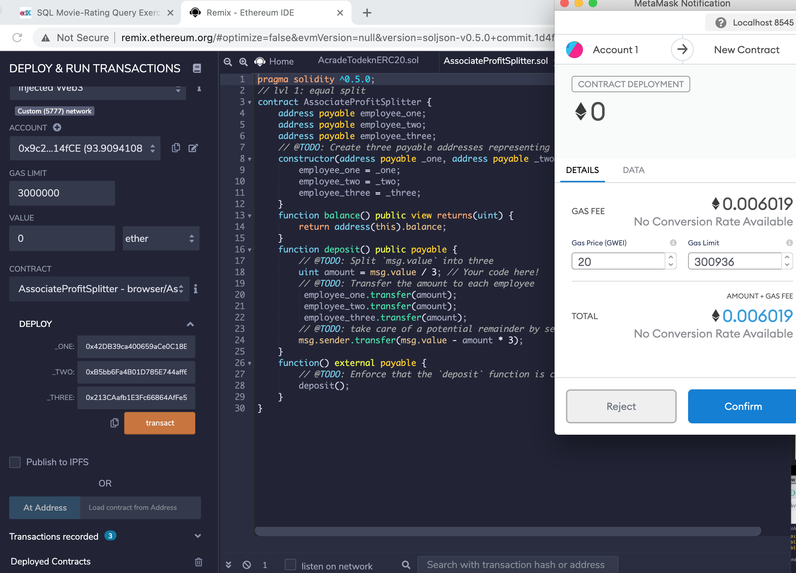
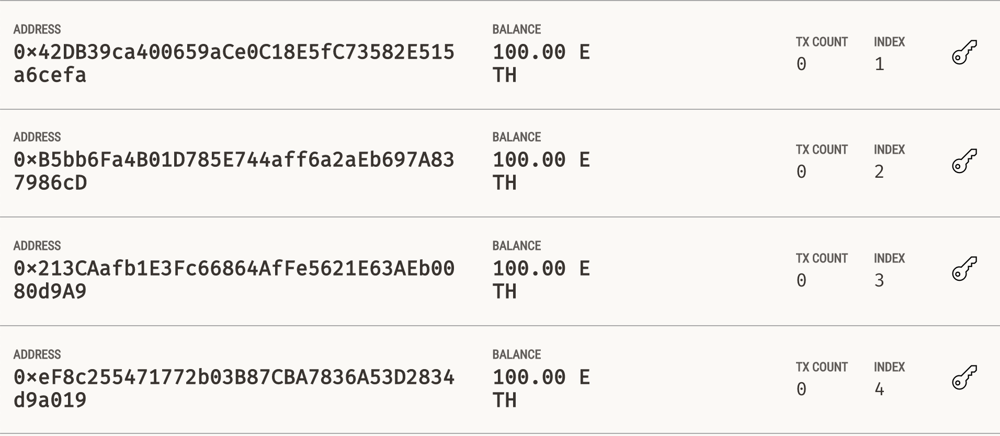
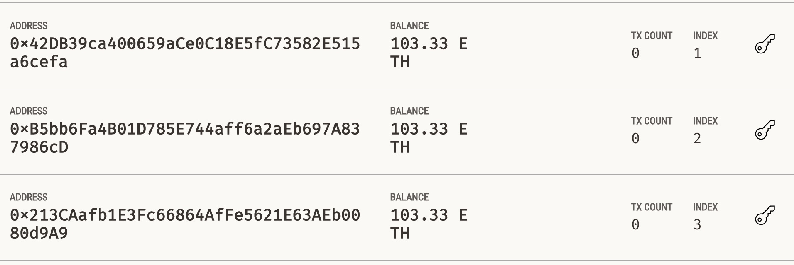
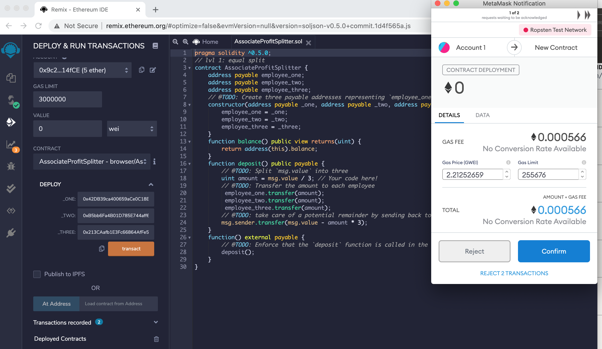
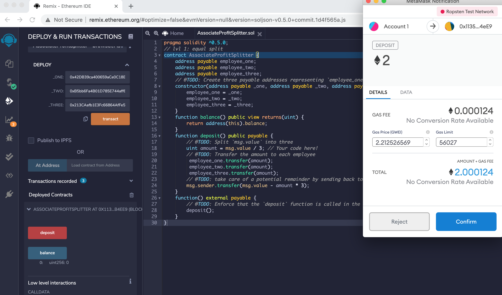

### Solidity

In this assignment, I built smart contracts to automate some company finances to make everyone's lives easier, increase transparency, and to make accounting and auditing practically automatic! To streamline the operation I used smart contracts with Solidity, creating a few `ProfitSplitter` contracts. These contracts will do several things:

* Pay your Associate-level employees quickly and easily.

* Distribute profits to different tiers of employees.

* Distribute company shares for employees in a "deferred equity incentive plan" automatically.

## Instructions

This assignment has 3 levels of difficulty, with each contract increasing in complexity and capability. Start with Level 1:

* **Level One** is an `AssociateProfitSplitter` contract. This accepts Ether into the contract and divide the Ether evenly among the associate level employees. This will allow the Human Resources department to pay employees quickly and efficiently.

* **Level Two** is a `TieredProfitSplitter` that will distribute different percentages of incoming Ether to employees at different tiers/levels. For example, the CEO gets paid 60%, CTO 25%, and Bob gets 15%.

* **Level Three** is a `DeferredEquityPlan` that models traditional company stock plans. This contract will automatically manage 1000 shares with an annual distribution of 250 over 4 years for a single employee.

### Starting the project:

I used [Remix IDE](https://remix.ethereum.org) and create a new contract called `AssociateProfitSplitter.sol` using the starter code for level one.

While developing and testing contract, I used the [Ganache](https://www.trufflesuite.com/ganache) development chain, and point MetaMask to `localhost:8545`, or replace the port with what I have set on workspace.

### Level One: The `AssociateProfitSplitter` Contract

In the `Deploy` tab in Remix, I deployed the contract to my local Ganache chain by connecting to `Injected Web3` and ensuring MetaMask is pointed to `localhost:8545`.

I to filled in the constructor parameters with your designated `employee` addresses. 

I sent equal amount of money to all three employees. Check my Genache for amended balances: 

### Level Two: The `TieredProfitSplitter` Contract

In this contract, rather than splitting the profits between Associate-level employees, I calculated rudimentary percentages for different tiers of employees (CEO, CTO, and Bob).

* Deploy and test the contract functionality by depositing various Ether values (greater than 100 wei).

  * The provided `balance` function can be used as a test to see if the logic you have in the `deposit` function is valid. Since all of the Ether should be transferred to employees, this function should always return `0`, since the contract should never store Ether itself.

  * Note: The 100 wei threshold is due to the way we calculate the points. If we send less than 100 wei, for example, 80 wei, `points` would equal `0` because `80 / 100` equals `0` because the remainder is discarded. We will learn more advanced arbitrary precision division later in the course. In this case, we can disregard the threshold as 100 wei is a significantly smaller value than the Ether or Gwei units that are far more commonly used in the real world (most people aren't sending less than a penny's worth of Ether).

### Level Three: The `DeferredEquityPlan` Contract

In this contract, I managed an employee's "deferred equity incentive plan" in which 1000 shares are distributed over 4 years to the employee. 

* **A two-minute primer on deferred equity incentive plans:** In this set-up, employees receive shares for joining and staying with the firm. They may receive, for example, an award of 1,000 shares when joining, but with a 4 year vesting period for these shares. This means that these shares would stay with the company, with only 250 shares (1,000/4) actually distributed to and owned by the employee each year. If the employee leaves within the first 4 years, he or she would forfeit ownership of any remaining (“unvested”) shares.

  * If, for example, the employee only sticks around for the first two years before moving on, the employee’s account will end up with 500 shares (250 shares * 2 years), with the remaining 500 shares staying with the company. In this above example, only half of the shares (and any distributions of company profit associated with them) actually “vested”, or became fully owned by the employee. The remaining half, which were still “deferred” or “unvested”, ended up fully owned by the company since the employee left midway through the incentive/vesting period.

  * Specific vesting periods, the dollar/crypto value of shares awarded, and the percentage equity stake (the percentage ownership of the company) all tend to vary according to the company, the specialized skills, or seniority of the employee, and the negotiating positions of the employee/company. If you receive an offer from a company offering equity (which is great!), just make sure you can clarify the current dollar value of those shares being offered (based on, perhaps, valuation implied by the most recent outside funding round). In other words, don’t be content with just receiving “X” number of shares without having a credible sense of what amount of dollars that “X” number represents. Be sure to understand your vesting schedule as well, particularly if you think you may not stick around for an extended period of time.

* Deploy and test your contract locally.

  * For this contract, test the timelock functionality by adding a new variable called `uint fakenow = now;` as the first line of the contract, then replace every other instance of `now` with `fakenow`. Utilize the following `fastforward` function to manipulate `fakenow` during testing.

I tried to ditribute shares four times and got 1000 units of cotracts: 

### Deploy the contracts to a live Testnet - Ropsten network

I switched my MetaMask to the Ropsten network. I had 5 test Ether on this network!

After switching MetaMask to Ropsten network, deploy the contracts as before and copy/keep a note of their deployed addresses. The transactions will also be in your MetaMask history, and on the blockchain permanently to explore later.

Sending 2 ETH to the accounts: 

## Resources

Building the next financial revolution isn't easy, but we need your help, don't be intimidated by the semicolons!

There are lots of great resources to learn Solidity. Remember, you are helping push the very edge of this space forward,
so don't feel discouraged if you get stuck! In fact, you should be proud that you are taking on such a challenge!

For some succinct and straightforward code snips, check out [Solidity By Example](https://github.com/raineorshine/solidity-by-example)

For a more extensive list of awesome Solidity resources, checkout [Awesome Solidity](https://github.com/bkrem/awesome-solidity)

Another tutorial is available at [EthereumDev.io](https://ethereumdev.io/)

If you enjoy building games, here's an excellent tutorial called [CryptoZombies](https://cryptozombies.io/)

